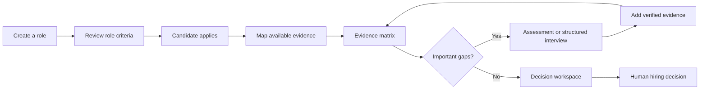
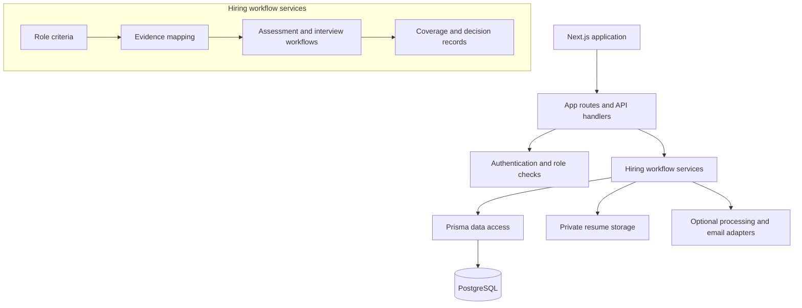
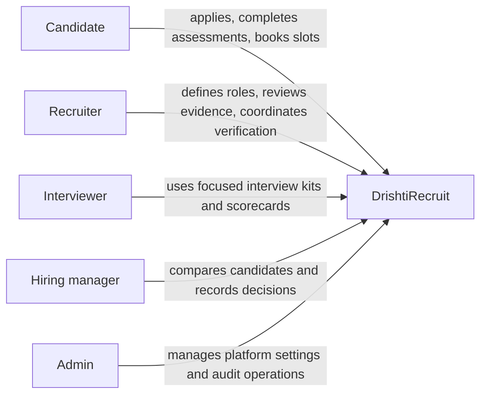

# DrishtiRecruit

An evidence-first applicant tracking system for teams that need more than a resume match before making a hiring decision.

DrishtiRecruit keeps three related questions separate:

- **Fit** — how closely the available information aligns with the role.
- **Evidence coverage** — how much support exists for each approved criterion.
- **Decision coverage** — whether the important criteria have been evaluated well enough for a person to decide.

The product is designed around a simple principle: a strong-looking candidate is not automatically a decision-ready candidate.

## The hiring loop



This keeps uncertainty visible instead of burying it inside one score. Recruiters can see the source behind a conclusion, choose a consistent way to verify gaps, and retain the context of the final decision.

## What the product covers

| Area | What DrishtiRecruit makes clear |
| --- | --- |
| Roles | Recruiter-approved criteria, priorities, and evidence expectations |
| Applications | Fit, evidence coverage, decision coverage, and criterion-level status |
| Verification | Reusable assessments and structured interviews linked to open criteria |
| Comparison | A side-by-side view that separates apparent fit from verified coverage |
| Decisions | Human-owned decisions, evidence snapshots, and integrity checks |
| Operations | Role-based access, audit records, notifications, analytics, and retention controls |

## A walkthrough of the decision workspace

1. Create a role and review its criteria before they affect evaluation.
2. Open a candidate to inspect the evidence matrix rather than relying on an aggregate match.
3. For a weak or missing must-have, choose a consistent verification step.
4. Use the resulting assessment or interview evidence to update the same matrix.
5. Compare candidates with fit, evidence, and decision coverage shown separately.
6. Record a human decision with its evidence context and any required override reason.

The local seed data is deliberately arranged for this story: Priya has high apparent fit but incomplete coverage, Arjun has strong evidence, and Meera has clear gaps. See [the demo flow](docs/FINAL_DEMO_FLOW.md) for the recommended presentation order.

## Product architecture



The application is intentionally server-authoritative for access control, workflow transitions, assessment timing, scoring arithmetic, decision records, and file validation. Optional processing may suggest drafts or extract evidence, but approved criteria and final hiring decisions remain human-owned.

For a fuller technical view, including trust boundaries and deployment flow, read [Architecture](docs/ARCHITECTURE.md).

## Roles



## Technology

- Next.js 16 and React 19
- TypeScript
- PostgreSQL and Prisma
- Server-side PDF/DOCX text extraction
- Vitest and GitHub Actions validation
- Docker Compose for local PostgreSQL and the full-stack topology

## Repository map

```text
src/app/          Screens and route handlers
src/components/   Reusable interface components
src/services/     Workflow, evidence, decision, and integration services
src/lib/          Authentication, storage, reporting, and shared utilities
prisma/           Schema, migrations, and demo seed
docs/             Architecture, demo, API, and validation documentation
tests/            Focused domain and safety tests
```

## Run locally

Requirements: Node.js 22+, Docker Desktop, and a local `.env` file.

```bash
cp .env.example .env
# Set a >=32-character JWT_SECRET and a distinct >=32-character TWO_FACTOR_ENCRYPTION_KEY.
docker compose up -d postgres
npm install
npm run prisma:generate
npm run db:migrate
npm run db:seed
npm run qa:static
npm run typecheck
npm test
npm run build
npm run dev
```

Open `http://localhost:3000` after the development server starts. The default local database is named `drishtirecruit` and resume files are kept under `.drishtirecruit-data/` unless `RESUME_STORAGE_DIR` is set.

For the production-shaped local topology, set the required secrets in `.env` and run:

```bash
docker compose -f docker-compose.full.yml up --build
```

Add `--profile demo` to seed that Docker environment. The full stack uses `prisma db push` only as a demo/bootstrap convenience; a real production release should use committed migrations and `prisma migrate deploy`.

## Local demo accounts

All seeded accounts use `DrishtiRecruit123!` in a disposable local database.

- `recruiter@drishtirecruit.local`
- `manager@drishtirecruit.local`
- `interviewer@drishtirecruit.local`
- `candidate@drishtirecruit.local` — Priya, high fit with open evidence gaps
- `arjun@drishtirecruit.local` — Arjun, evidence-rich comparison candidate
- `meera@drishtirecruit.local` — Meera, clear role gaps
- `admin@drishtirecruit.local`

These credentials are local-demo only. See [Demo credentials](docs/DEMO_CREDENTIALS.md) and [Local setup](docs/LOCAL_SETUP.md) for details.

## Optional processing adapter

The default configuration uses a deterministic heuristic path. An optional structured provider adapter can be enabled with `AI_PROVIDER`, `OPENAI_API_KEY`, and `OPENAI_MODEL`. Provider calls are time-bounded and can fall back to the deterministic path. Suggested criteria do not affect evaluation until a recruiter approves them.

## Deliberate limits

DrishtiRecruit does not claim validated hiring weights, autonomous hiring or rejection, fairness certification, legal compliance, emotion/personality inference, or secure remote execution of arbitrary candidate code. A production deployment still needs calibrated validation, privacy and legal review, secure object storage, centralized rate limiting, monitoring, and load testing.

## Helpful references

- [Architecture](docs/ARCHITECTURE.md)
- [Demo flow](docs/FINAL_DEMO_FLOW.md)
- [Judge guide](docs/JUDGE_GUIDE.md)
- [API contracts](docs/API_CONTRACTS.md)
- [ER diagram](docs/ER_DIAGRAM.md)
- [Validation report](docs/VALIDATION_REPORT.md)
