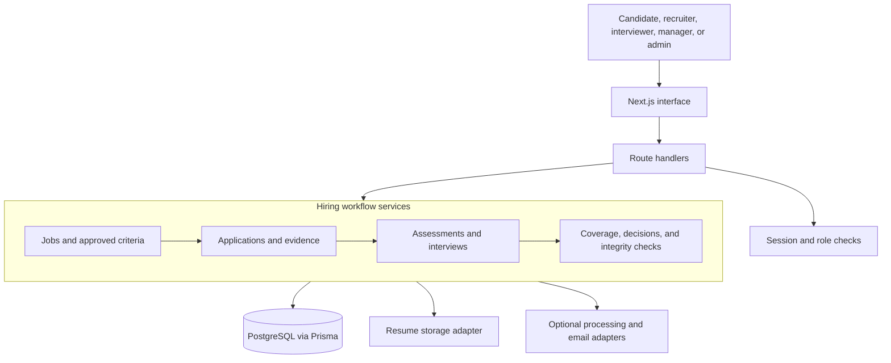
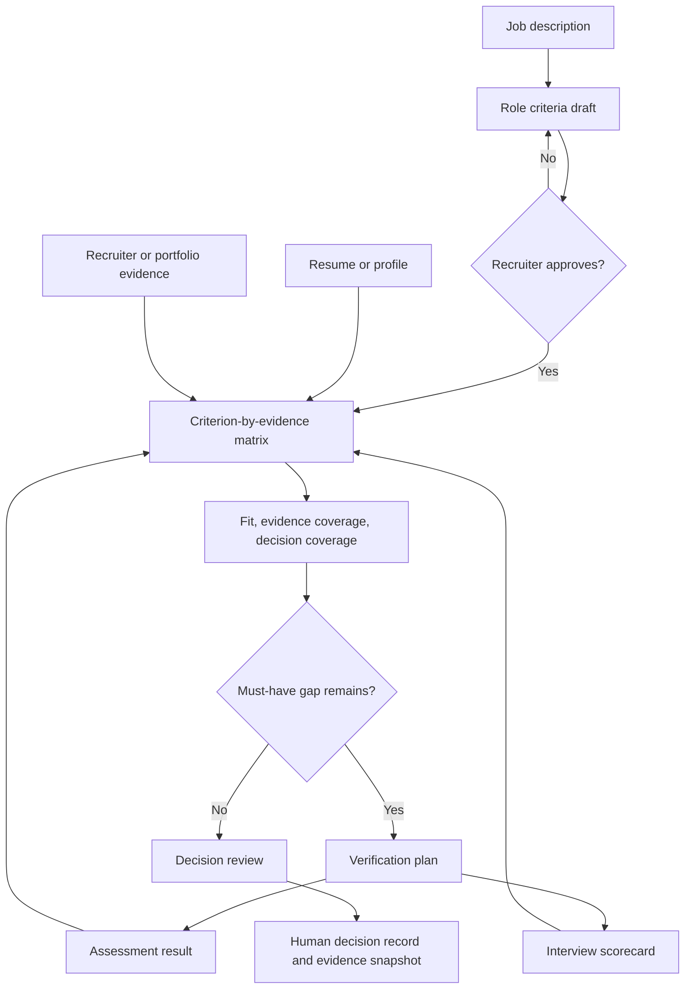
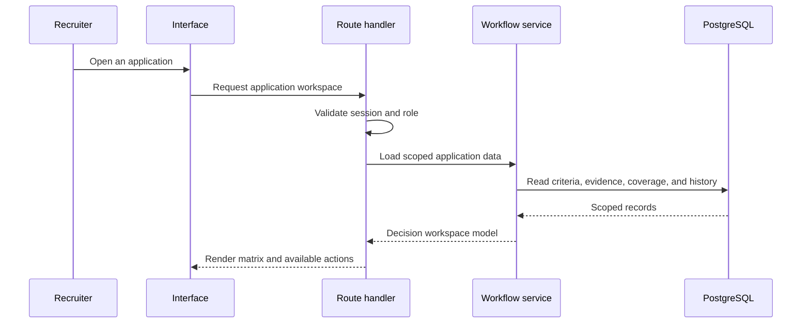
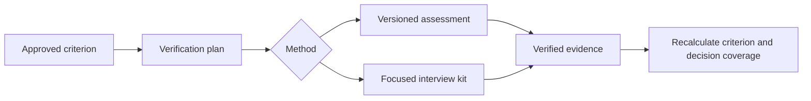
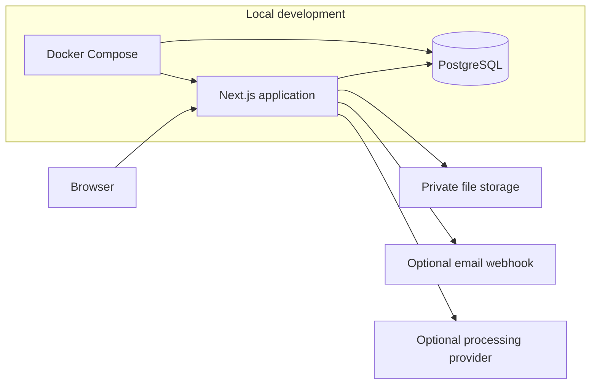

# DrishtiRecruit architecture

## Design intent

DrishtiRecruit turns a role into approved criteria, links candidate evidence to those criteria, and keeps the final hiring decision with an authorized person. The system deliberately distinguishes an apparent fit from the evidence needed to support a decision.

## System overview

## Evidence and decision flow

Each criterion evaluation retains its evidence sources and current status. The system can recommend a consistent next step, but it does not authorize or make the hiring decision.

## Request boundary

Route handlers enforce authentication, company scope, and role rules before invoking workflow services. Services own policy checks, transactions, coverage recalculation, and audit records. Prisma is the only application path to PostgreSQL.

## Trust boundaries

| Boundary | Control |
| --- | --- |
| Browser to route handler | HttpOnly session cookies, validation, security headers, and origin checks where applicable |
| Route handler to workflow service | Role and company scope checks; server-authoritative state transitions |
| Workflow to database | Prisma queries and transactions for conflict-sensitive operations |
| File uploads | Type/size checks, file-signature validation, private storage adapter, and duplicate detection |
| Optional provider calls | Time limit, bounded data flow, deterministic fallback, and run metadata rather than raw duplicated inputs |
| Decisions | Authorized human action, evidence snapshot, override reason where required, and audit history |

## Assessment and interview controls

Assessment content and duration are locked after assignment to preserve comparability. Interview scorecards can evaluate only the criteria in the assigned kit. Assessment deadlines, slot booking, and terminal application transitions are checked on the server.

## Deployment topology

`docker-compose.yml` starts PostgreSQL for local development. `docker-compose.full.yml` adds schema initialization, the application container, health checks, a named resume volume, and an optional demo seed profile.

## Implementation map

| Concern | Main location |
| --- | --- |
| Screens and API handlers | `src/app/` |
| Shared interface components | `src/components/` |
| Access policy and sessions | `src/lib/auth/`, `src/services/access/` |
| Job, application, and stage workflows | `src/services/job/`, `src/services/application/` |
| Evidence, coverage, and verification | `src/services/decisionCoverage.ts`, `src/services/verification*` |
| Assessments and interviews | `src/services/assessment/`, `src/services/interview/` |
| Decision records and reporting | `src/services/decision/`, `src/services/reporting/` |
| Data model and demo data | `prisma/schema.prisma`, `prisma/seed.ts` |

## Implementation terminology

Some internal names such as the `AiRun` model and the `/recruiter/ai-transparency` route are retained for compatibility with the existing Prisma schema and route contracts. The product interface calls this area **Processing history** and **Execution history**. The internal names do not change the product boundary: they record operational metadata and never own hiring state or final decisions.
