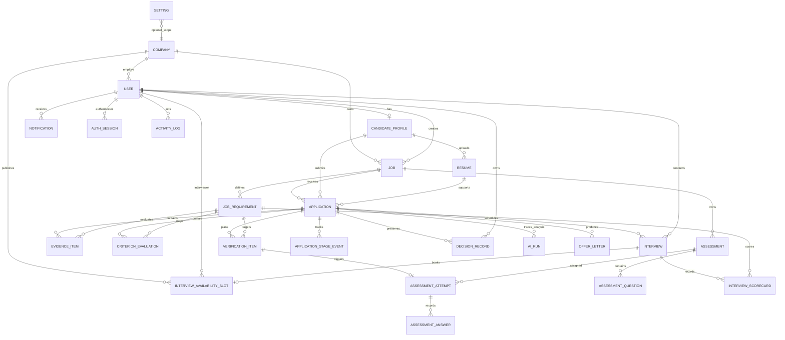

# DrishtiRecruit ER diagram — v1.3

The Prisma schema is the source of truth. This diagram highlights the main recruitment, evidence, assessment and scheduling relationships used in the demo.

## Evidence backbone
`JOB_REQUIREMENT -> EVIDENCE_ITEM -> CRITERION_EVALUATION` is the core DrishtiRecruit relationship. Resume, assessment and interview modules all write evidence against the same recruiter-approved criterion. Decision Coverage is derived from those criterion evaluations rather than stored as an opaque model judgment.

## AI provenance backbone
`AI_RUN` stores operational metadata plus SHA-256 hashes of model/heuristic inputs and outputs. Raw candidate/job text is deliberately not duplicated into this ledger. `DECISION_RECORD.evidenceSnapshotSha256` makes the historical DecisionTrace snapshot tamper-evident within the application data model.

## Scheduling backbone
`INTERVIEW_AVAILABILITY_SLOT -> INTERVIEW` is one-to-one only after a candidate books a slot. Unbooked slots remain available; booked slots retain their relation for auditability.
