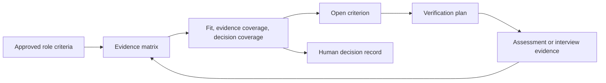

# DrishtiRecruit judge guide

## Product thesis

DrishtiRecruit is an evidence-first Applicant Tracking System. It separates **fit**, **evidence coverage**, and **decision coverage** so a hiring team can see the difference between a promising resume and a decision supported by enough comparable evidence.

It does not make the final hiring decision. It shows the evidence behind each approved role criterion, surfaces unresolved must-haves, supports consistent verification, and records the authorized human decision with its context.

## Fastest evaluation path

1. Sign in as `recruiter@drishtirecruit.local` with `DrishtiRecruit123!`.
2. Open **Backend Engineer** and then **Priya Sharma**.
3. Compare the three main signals: strong fit alongside lower evidence and decision coverage.
4. Open the Evidence Matrix and inspect the Docker and Communication gaps.
5. Use the **Verification plan** to show the standardized next step.
6. Compare Priya with Arjun. Arjun has slightly lower apparent fit but stronger verified coverage.
7. Sign in as a Hiring Manager and inspect the decision record. Incomplete coverage requires a reason before a terminal recommendation can proceed.
8. Open the Decision Integrity Audit and **Processing history**.
9. Optionally show security, analytics, Assessment Studio, interview self-scheduling, and the admin audit controls.

## The core loop

## What makes the approach distinct

Many hiring systems compress candidate information into one rank or match. DrishtiRecruit instead asks three separate questions:

- **Fit:** How closely does current information align with the role?
- **Evidence coverage:** How much usable support is available?
- **Decision coverage:** Have the required criteria been evaluated enough to support a decision?

This matters in the seed scenario: Priya can look highly aligned yet need more verification, while Arjun can have more complete evidence. The product avoids treating either view as an automatic hiring decision.

## Product safeguards worth inspecting

- Recruiters approve criteria before they affect evaluation.
- Sensitive-trait criteria are guarded from automated-scoring approval.
- Evidence excerpts must be traceable to the uploaded resume before they are saved.
- Versioned assessments preserve comparability after assignment.
- Assessment deadlines and workflow state are server-authoritative.
- Interviewer access is assignment-scoped; salary-bearing offers remain protected.
- Terminal decisions and their stage transitions are committed together.
- Processing history retains provider, fallback, and hash metadata without duplicating raw candidate or role text.
- Decision evidence snapshots are hashed and rechecked in the evidence packet.

## Deliberate limits

DrishtiRecruit does not claim validated hiring accuracy, fairness certification, legal compliance, emotion/personality inference, autonomous hiring, or secure execution of untrusted candidate code. It is a decision-support workflow designed to make evidence and uncertainty visible to human reviewers.

## Demo accounts

See [Demo credentials](DEMO_CREDENTIALS.md) for the seeded local-only accounts. Do not reuse those credentials outside a disposable development database.
